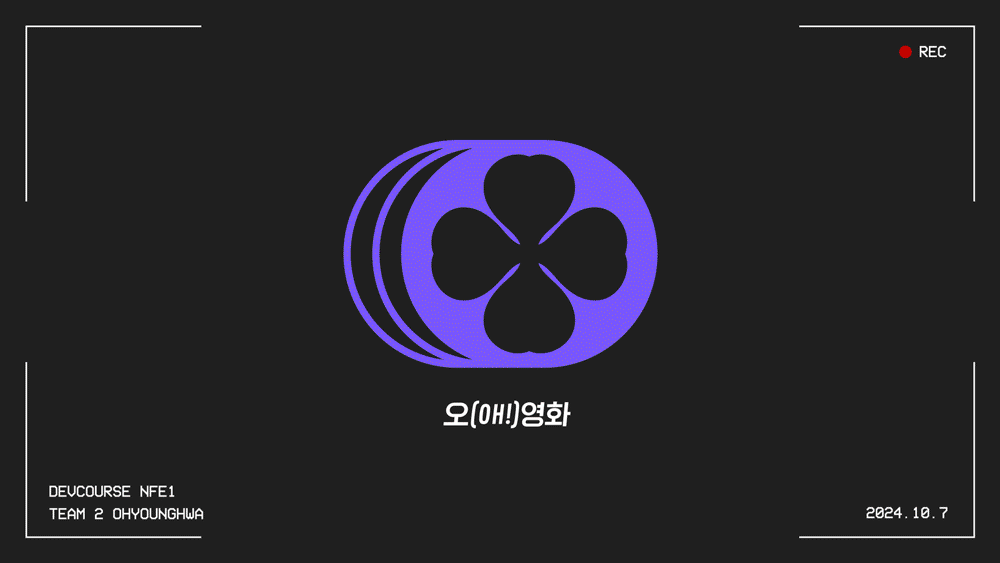
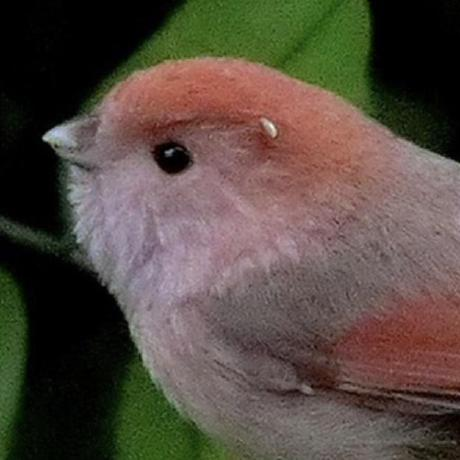

# 📽️오(oh!)영화

영화 소셜 네트워크 서비스(SNS)

## 🎞️ 프로젝트 소개
영화와 OTT 서비스에 대한 리뷰뿐만 아니라 자유롭게 영화를 주제로 실시간 토론을 할 수 있는 소셜 네트워크 서비스(SNS)입니다. 유저들이 영화에 대해 자신만의 리뷰를 작성하고, 서로의 의견을 나눌 수 있는 커뮤니티 공간을 제공합니다.

### 작업기간
2024/9/12 ~ 2024/10/7

## 주요 기능
- **영화토론 & 리뷰 작성** : 실시간으로 다양한 영화에 대한 의견 공유
- **팔로우 & 알림** : 유저 간의 상호작용과 소통 지원
- **영화 정보 제공** : 개봉일, 줄거리, 리뷰 등 다양한 정보 제공
- **검색 기능** : 영화, 게시글, 해시태그 등을 검색해 원하는 정보 찾기
- **마이페이지** : 개인페이지에서 본인의 글이나 리뷰, 좋아요 게시글 조회 및 유저 정보 수정

## Skills

## 팀원 소개

  
|||||
|:---:|:---:|:---:| :---:|
| [김용환](https://github.com/yonghwna) | [최수진](https://github.com/tomatto0) | [최윤성](https://github.com/cho1ys)  | [조현진](https://github.com/JOEIH) |
|팀원|팀장|팀원|팀원|
|영화정보|홈(타임라인)  디자인|검색, 알림|마이페이지|

 

## 📙 기획 문서

개발 보고서

[🔗 개발보고서 바로가기](https://docs.google.com/document/d/1C-1qJz8wFXcEDpyEzsMVHTj_YRlnftQBGVjwVxweEAU/edit?tab=t.0)

프로젝트 노션

[🔗 Notion 바로가기](https://neul.notion.site/2-159dc69321d780baafb3c623ea6e8b86?pvs=4)

요구사항 명세서

[🔗 요구사항 명세서 바로가기](https://docs.google.com/spreadsheets/d/12qMOclTXYbzc4r6kcgqZqwZhbI4VUvSuB4gtFj5n86g/edit?gid=0#gid=0)

FIGMA

[🔗 FIGMA 바로가기](https://www.figma.com/design/DcxEgok2J8A7u1X8cLJ8O0/%EC%98%A4!%EC%98%81%ED%99%94-%ED%99%94%EB%A9%B4%EA%B8%B0%ED%9A%8D%EC%84%9C-%EC%99%B8%EB%B6%80%EA%B3%B5%EA%B0%9C%EC%9A%A9?node-id=0-1&t=W5ZOALXKEdeBgrHc-1)

